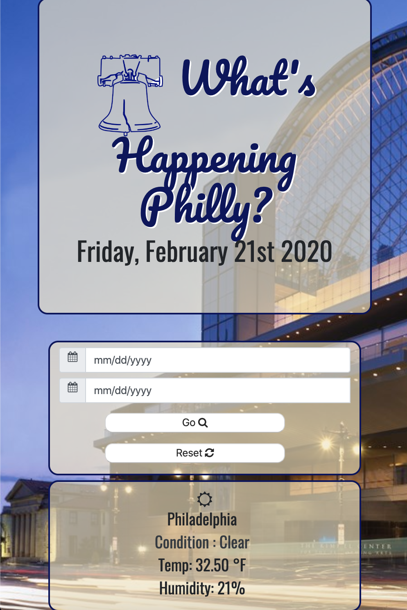
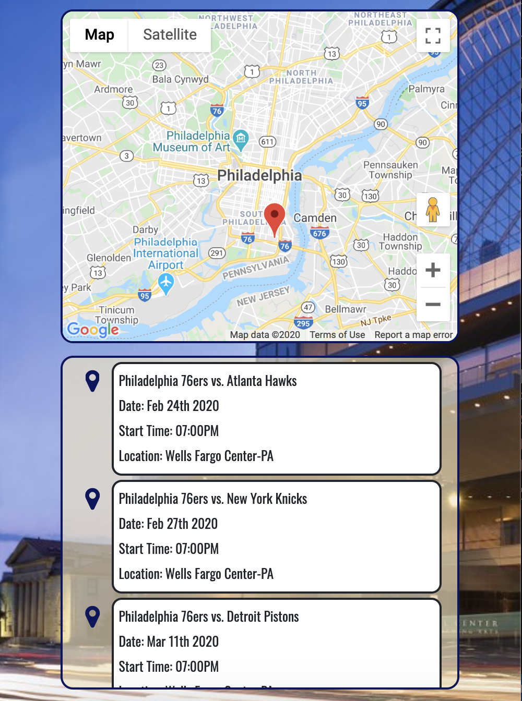

# **What's Happening Philly**
Link to website:(https://cfech.github.io/What-s-Happening-Philly/)

What's Happening Philly is a web based application that allows users to search for various events taking place in Philadelphia. The user is able to search for specific events or general categories by keyword, within a specific time frame. Once a search has been initiated, a list will populate providing all the events that match the users search criteria. The event list provides useful information for the user about the event such as the name of the event, date ,start time and location. 
The application was built using HTML, CSS, JavaScript & jQuery. We also utilized several APIs, Bootstrap 4, Moment.js and FontAwesome in the web development processes. The links are provided below; 

Links
* [Google Maps API](https://www.google.com/maps/@?api=1&map_action=map)
* [Ticket Master API](https://app.ticketmaster.com/discovery/v2/)
* [OpenWeatherMAP API](https://openweathermap.org/current)
* [BootStrap via StackPath CDN](https://stackpath.bootstrapcdn.com)
* [AJAX via Cloudflare CDN](https://cdnjs.cloudflare.com/ajax/libs/font-awesome/4.7.0/css/font-awesome.css)
* [JQuery](https://code.jquery.com/jquery-3.4.1.min.js)